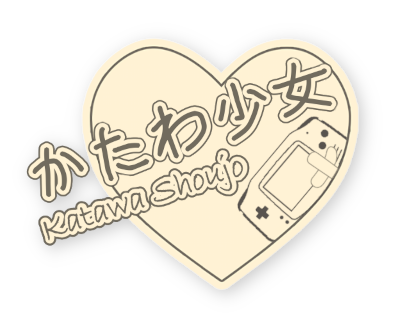

# Contributing

First of all, thank you for considering contributing to [Katawa Shoujo - Game Boy Advance Port](https://github.com/neparij/katawa-shoujo-agb)! Your contributions are what make this project better and gives the motivation to keep working on it.

## New Contributors

If you are just starting out and would like to get in touch, drop a message in [Discord server](https://discord.gg/9FyENHtUxy) in the `#contributing` channel. And feel free to ask any questions you might have!

---

## I am not a developer, can I still contribute?

Absolutely! There are many ways to contribute to the project even if you are not a developer:

### Testing

Play the game and report any bugs or issues you encounter. Your feedback is invaluable in improving the game.

### Graphics

If you have skills in graphic design, you can help create or improve assets for the game.

### Sound
There is a bunch of OST-related work that can be done - adopting tracks to this tiny hardware is one of that challenges.

---

## Building the Project

Check the [README](README.md#requirements) for instructions on how to set up the development environment and build the project.

## Commit Guidelines

When contributing code, please follow these guidelines to ensure a smooth review process:

- **Fork the repository** and create a new branch from `develop`.
- **Write well-formed commit messages** that describe the changes you mad and follow the [Conventional Commits](https://www.conventionalcommits.org) specification.
- **Test your changes** thoroughly before submitting a pull request.

## Pull Requests

When you are ready to submit your changes:

- **Create a pull request** against the `develop` branch.
- **Name your pull request** clearly and provide a detailed description of the changes you made. Changelog is generated from PR titles, so make them descriptive and not ambiguous.
- **Link any related issues** in the pull request description if applicable. You can use keywords like `closes #issue_number` to automatically close issues when the PR is merged.

