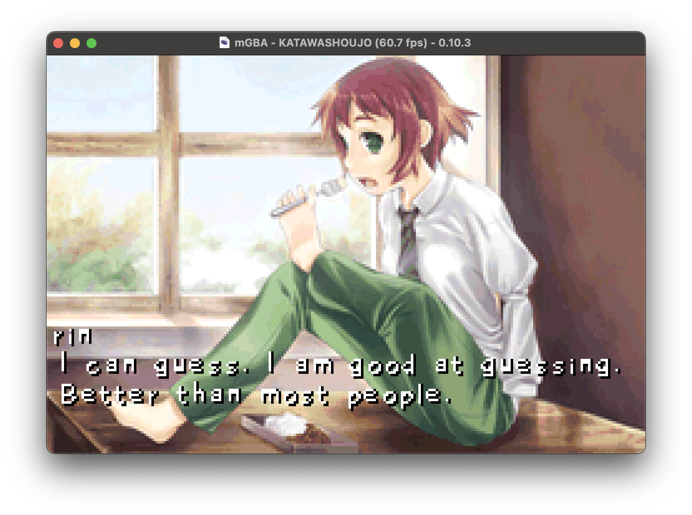

# Katawa Shoujo - Game Boy Advance Port

A faithful adaptation of *Katawa Shoujo* for the GBA, powered by the [Butano framework](https://github.com/GValiente/butano). Includes Python tools to convert assets and scripts from the **[Katawa Shoujo: Re-Engineered](https://github.com/fleetingheart/ksre)** project.



---

## Features

- **Visual Novel Gameplay** optimized for GBA.
- **Tools** for converting assets and scripts.

---

## Requirements

1. **DevkitARM** ([Setup Guide](https://devkitpro.org/wiki/Getting_Started))
   - Windows: Use [DevkitPro Installer](https://github.com/devkitPro/installer/releases/latest).
   - macOS/Linux: Install via `devkitpro-pacman`.
     ```bash
     sudo dkp-pacman -S devkitARM
     ```
   - Verify: `arm-none-eabi-gcc --version`
2. **Python 3.9+** for tools.

---

## Contribution

1. **Fork** the repository.
2. **Clone** the forked repository.
3. **Create a branch** for your feature.
4. **Test** your changes on emulators and hardware.
5. Submit a pull request.

---

## Credits

- **[Four Leaf Studios](https://www.katawa-shoujo.com)** for creating *Katawa Shoujo*.
- **[Butano Framework](https://github.com/GValiente/butano)** by GValiente for the GBA development framework.
- **[Katawa Shoujo: Re-Engineered](https://github.com/fleetingheart/ksre)** for the great adaptation Katana Shoujo to the modern Ren'Py engine.

---

## License

This project is licensed under the **Creative Commons Attribution-NonCommercial-NoDerivatives 4.0 International License**. See the [LICENSE](LICENSE.md) file for details.

