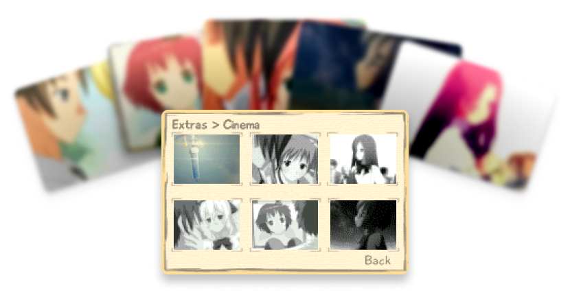

# Katawa Shoujo - Game Boy Advance Port

A faithful adaptation of *Katawa Shoujo* for the GBA, powered by
the [Butano framework](https://github.com/GValiente/butano). Includes Python tools to convert assets and scripts from
the **[Katawa Shoujo: Re-Engineered](https://github.com/fleetingheart/ksre)** project.

[](https://neparij.itch.io/katawa-shoujo-gba)

## Screenshots


## FMVs also included!



---

## Features

- **Visual Novel Gameplay** optimized for GBA.
- **The entire OST** carefully adapted for the GBA.
- **Video Cutscenes** fits alongside the game.
- **Tools** for converting assets and scripts.
- **Huge bitmaps** to display backgrounds with more than 1024 tiles (used for events).

---

## Requirements

1. **DevkitARM** ([Setup Guide](https://devkitpro.org/wiki/Getting_Started))
    - Windows: Use [DevkitPro Installer](https://github.com/devkitPro/installer/releases/latest).
    - macOS/Linux: Install via `devkitpro-pacman`.
      ```bash
      sudo dkp-pacman -S devkitARM
      ```
    - Verify: `arm-none-eabi-gcc --version`
2. **Python 3.12** for tools.
3. **[Butano](https://github.com/neparij/butano/tree/katawa)**
   fork with custom audio integrated (uses branch `katawa`)
4. **[libsavgba](https://github.com/laqieer/libsavgba)**
5. ***For CLion IDE users***:
    - Install `compiledb`
        - macOS:
          ```bash
          brew install compiledb
          ```
        - Linux:
          ```bash
          pip install --user compiledb
          ```
    - Generate `compile_commands.json`:
      ```bash
      compiledb make -j$(nproc)
      ```
    - Import the project in CLion as a Compilation Database project
    - Configure the devkitARM toolchain in CLion (see devkitARM setup guides)

---

## Contribution

1. **Fork** the repository.
2. **Clone** the forked repository.
3. **Create a branch** for your feature.
4. **Test** your changes on emulators and hardware.
5. Submit a pull request.

---

## Credits

- **[Four Leaf Studios](https://www.katawa-shoujo.com)** for creating *Katawa Shoujo*.
- **[Butano Framework](https://github.com/GValiente/butano)** by GValiente for the GBA development framework.
- **[ulc-codec](https://github.com/Aikku93/ulc-codec)** by Aikku93 for the Ultra-low-complexity MDCT Audio Codec.
- **[8ad](https://pineight.com/gba/#8ad)** by Damian Yerrick.
- **[GBA-image-tools](https://github.com/HorstBaerbel/GBA-image-tools)** by HorstBaerbel for the DXTV video codec.
- **[libsavgba](https://github.com/laqieer/libsavgba)** by laqieer for Flash saving abilities.
- **[Katawa Shoujo: Re-Engineered](https://codeberg.org/fhs/katawa-shoujo-re-engineered)** by
  **[Fleeting Heartbeat Studios](https://www.fhs.sh/)** for the great adaptation Katawa Shoujo to the modern Ren'Py
  engine.

## Special Thanks

Some tools and projects may no longer be part of the current build, but they played a meaningful role in earlier stages of development. Their ideas, inspiration, and technical foundations helped shape this project, and for that, I'm truly grateful:

- **[afska](https://github.com/afska)** for the GSM Player Butano integration and supporting the development process.
- **[libagmv](https://github.com/RyandracusCodesGames/libagmv)** by RyandracusCodesGames for the AGMV video codec.
- **[GSM Player](https://github.com/pinobatch/gsmplayer-gba)** by Damian Yerrick for the GBA audio player.

---

## License

This project is licensed under the
**Creative Commons Attribution-NonCommercial-NoDerivatives 4.0 International License**.
See the [LICENSE](LICENSE.md) file for details.

